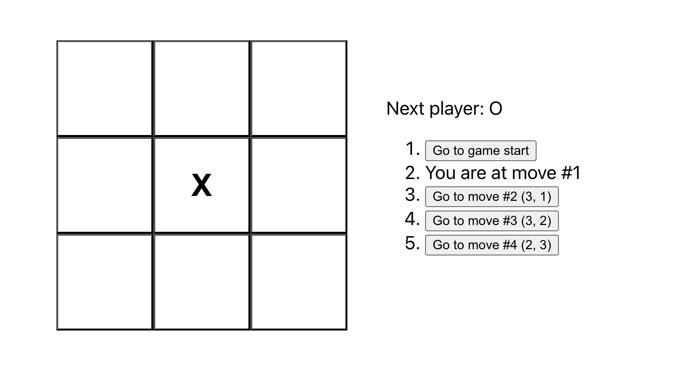

# Tic-Tac-Toe

A simple React-based Tic-Tac-Toe game for two players. Features move history and highlights the current move.

## Demo

  

## Features

- Two-player gameplay
- Move history (time travel)
- Highlights the current move
- Responsive design

## Installation

```bash
git clone https://github.com/lewischn/tictactoe.git
cd tictactoe
npm install
npm start

## Technologies

- React
- JavaScript
- Bootstrap
- CSS